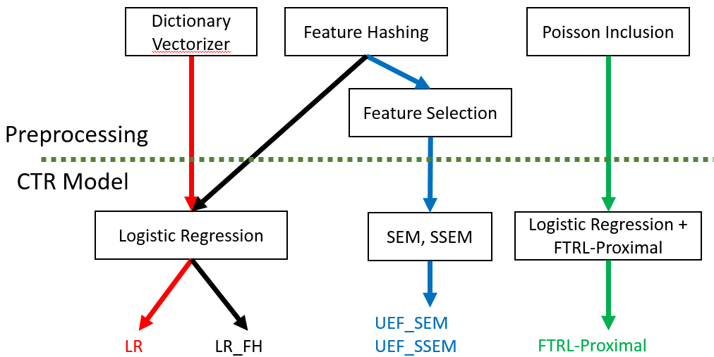

#Overview
##
* data: ftp://140.113.213.5/02_LAB/2_畢業資料/碩士/2016/王俊儫/data
* dependent libraries
   * pymongo, scikit-learn

##Library
* [lib](./lib)  
    * [classifier](./lib/classifier): CTR prediction models
    * [featureDistribution](./lib/featureDistribution): Count conditional mean for each hashed feature 
    * [featureHasher](./lib/featureHasher): A streaming feature hasher dealing with nested dict based on [sklearn FeatureHasher](http://scikit-learn.org/stable/modules/generated/sklearn.feature_extraction.FeatureHasher.html)
    * [featureSelector](./lib/featureSelector)
        * [poissonInclusion.py](./lib/featureSelector/poissonInclusion.py)
        * [significantFeatureSelector.py](./lib/featureSelector/significantFeatureSelector.py): select feature using featureDistribution
    * [fileDB](./lib/fileDB): read data

##Experiment

* [lr](./lr): LR
    * [offlineMemory](./lr/offlineMemory), [offlineTime](./lr/offlineTime), [onlineMemory](./lr/onlineMemory), [onlineTime](./lr/onlineTime), [standard](./lr/standard)
* [lr_fh](./lr_fh): LR_FH
    * [offlineMemory](./lr_fh/offlineMemory), [offlineTime](./lr_fh/offlineTime), [onlineMemory](./lr_fh/onlineMemory), [onlineTime](./lr_fh/onlineTime), [standard](./lr_fh/standard)
* [ftrlProximal](./ftrlProximal): FTRL-Proximal
    * [onlineMemory](./ftrlProximal/onlineMemory), [onlineTime](./ftrlProximal/onlineTime), [standard](./ftrlProximal/standard)
* [sem](./sem): UEF_SEM
    * [offlineMemory](./sem/offlineMemory), [offlineTime](./sem/offlineTime), [onlineMemory](./sem/onlineMemory), [onlineTime](./sem/onlineTime), [standard](./sem/standard)
* [sem](./ssem): UEF_SSEM
    * [offlineMemory](./ssem/offlineMemory), [offlineTime](./ssem/offlineTime), [onlineMemory](./ssem/onlineMemory), [onlineTime](./ssem/onlineTime), [standard](./ssem/standard)

\# standord: evaluate AUC and Loglikelihood for the model

##Plot Data
* [plot](./plot)
   * [e1](./plot/e1.py): Stability of Index Set
   * [e2_e3](./plot/e2_e3.py): Select size k vs AUC, loglikelihood
   * [e4](./plot/e4.py): Online Memory Usage
   * [e5](./plot/e5.py): Select size k vs Offline Memory Usage
   * [e6](./plot/e6.py): Online Run Time
   * [e7](./plot/e7.py): Select size k vs Offline Run Time
   * [e8_e9](./plot/e8_e9.py): AUC, Loglikelihood
   * [e10](./plot/e10.py): distingusiablity of each feature
   * [e11](./plot/e11.py): Select size k vs Online Memory Usage
   * [e12](./plot/e12.py): Offline Memory Usage
   * [e13](./plot/e13.py): Select size k vs Online Run Time
   * [e14](./plot/e14.py): Offline Run Time
